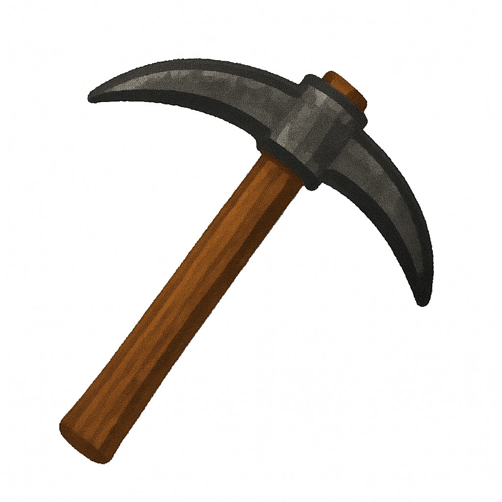

#  MineDraft: A Framework for Batch Parallel Speculative Decoding


## Environment Requirements

### System Requirements
- **OS**: Linux (tested on Ubuntu 22.04)
- **Python**: 3.9 - 3.12 (tested with 3.12)
- **CUDA**: >= 11.8 (tested with 12.8)
- **GPU**: 5× NVIDIA GPUs with sufficient VRAM recommended (e.g., A100 80GB, H100, or L40)

### Dependencies
- **vLLM**: 0.9.2
- **PyTorch**: 2.7.0
- **torch-scatter**: 2.1.2

## Installation

### 1. Create a Virtual Environment

```bash
python -m venv venv
source venv/bin/activate
```

Or using uv:

```bash
uv venv --python 3.12 --seed
source venv/bin/activate
```

Or using conda:

```bash
conda create -n minedraft python=3.12 -y
conda activate minedraft
```

### 2. Install vLLM

```bash
pip install vllm==0.9.2 --extra-index-url https://download.pytorch.org/whl/cu128
```

### 3. Install MineDraft

```bash
# Install the package with benchmark dependencies
pip install -e ".[benchmark]"
```

This will install:
- Core dependencies: `torch-scatter==2.1.2`
- Benchmark dependencies: `datasets`, `nvitop`, `pandas`, `numpy`, `matplotlib`, `IPython`, `tqdm`

## Dataset Preparation

Before running experiments, prepare the benchmark datasets:

```bash
# Create datasets directory
mkdir -p benchmarks/datasets

# Download and convert datasets
python scripts/convert_datasets.py
```

This will download and prepare the following datasets:
- **`ShareGPT.json`**: ShareGPT_V3_unfiltered_cleaned_split
- **`arena.json`**: LMSYS Chatbot Arena Conversations
- **`spec_bench.json`**: Spec-Bench
- **`tough.json`**: Domain-specific tough questions

## Experiment Structure

The experiments are organized in the `scripts/` directory:

| Script | Description |
|--------|-------------|
| `experiment_1_*.sh` | Qwen3-32B with various draft models (0.6B, 1.7B, 4B) |
| `experiment_2_eagle_*.sh` | EAGLE models (Vicuna-33B, Vicuna-13B) |
| `experiment_2_llama_*.sh` | Llama-3.3-70B-AWQ with Llama-3.1-8B |
| `experiment_3_n_*.sh` | Multi-sample ablation |
| `experiment_4_bs_*.sh` | Batch size ablation (8, 16, 32, 64) |
| `experiment_5_tetris_*.sh` | Tetris VSR analysis experiments |
| `experiment_6_qwen8b.sh` | Qwen3-32B with Qwen3-8B |
| `experiment_7_qwen235b.sh` | Qwen3-235B-A22B-Instruct-2507-FP8 with Qwen3-14B |
| `experiment_8_nsys.sh` | NVIDIA Nsight profiling |

Most experiments have two subsets:
- `*_parallel.sh`: Parallel speculative decoding (requires 5 GPUs)
- `*_sequential.sh`: Sequential speculative decoding (requires 4 GPUs)

## Running Experiments

### Run All Experiments

```bash
cd scripts

# Run all experiments (both parallel and sequential)
bash run_all.sh

# Or run only parallel experiments
bash run_parallel.sh

# Or run only sequential experiments
bash run_sequential.sh
```

### Run Individual Experiments

```bash
cd scripts

# Example: Run parallel SD subset in Experiment 1 (Qwen3-32B)
bash experiment_1_parallel.sh

# Example: Run sequential SD subset in Experiment 2 (EAGLE models)
bash experiment_2_eagle_sequential.sh
```

### (Optional) Using the GPU Bootstrap Script

For environments with shared GPU resources, you may use the bootstrap script to automatically wait for available GPUs.

You will need to remove or comment out the `export CUDA_VISIBLE_DEVICES=` line in the experiment script before using the bootstrap script.

Example usage:
```bash
python scripts/bootstrap.py bash scripts/experiment_1_parallel.sh
```

The bootstrap script will:
- Monitor GPU availability
- Wait until 5 GPUs are available with <1% memory and utilization (you can adjust required GPU count and thresholds in the `main` function)
- Automatically set `CUDA_VISIBLE_DEVICES` and run the experiment

## Speculative Decoding Configuration

The experiments use various speculative decoding configurations via `--speculative-config`:

```json5
{
    "method": null,
    // null for standard SD, "eagle" for EAGLE
    "model": "<draft_model>",
    // HuggingFace model ID for draft model
    "draft_tensor_parallel_size": 1,
    // TP size for draft model, should be always 1
    "num_speculative_tokens": 5,
    // Number of draft tokens (k)
    "is_parallel": true,
    // Enable PSD (and MineDraft)
    "force_pearl": false,
    // Enable PEARL (is_parallel must be true if this set to true, will disable MineDraft)
    "tetris": true,
    // Enable Tetris
    "tetris_turn_on_batch_size": 1,
    // Batch size threshold for Tetris
    "tetris_capacity": 0,
    // Tetris capacity (0 means calculated by num_speculative_tokens * max_num_seqs, i.e., k * m)
    "tetris_extra_proposals": 3
    // Extra draft tokens for Tetris
}
```

## Hardware Configuration Example

- **Parallel mode**: 5 GPUs (4 for target model TP, 1 for draft model)
- **Sequential mode**: 4 GPUs (all for target model TP, draft shares resources)

## Results and Analysis

Benchmark trace results are stored in `benchmarks/trace/` as JSON lines (jsonl).

NVIDIA Nsight Systems profiling reports are stored in project root directory as `.nsys-rep` files.

For trace analysis, see the Jupyter notebook `benchmarks/trace/analyze_plots.ipynb` and its dependency `benchmarks/trace/analyze_traces.py`.

## Troubleshooting

### Out of Memory (OOM)
- Reduce `--gpu-memory-utilization` (default: 0.65)
- Reduce `--max-num-seqs` (batch size)
- Use smaller models

### CUDA Version Mismatch
Ensure CUDA >= 12.8 is installed and properly configured:
```bash
nvcc --version
nvidia-smi
```

### Model Download Issues
Models are automatically downloaded from HuggingFace. Ensure you have:
- Sufficient disk space or quota
- HuggingFace access tokens for gated models (e.g., Llama)

```bash
huggingface-cli login
```

### NVIDIA Nsight Systems Issues
If you use a old version of Nsight Systems (<2024.2), you may see an error during exporting profiling report:

> Wrong event order has been detected when adding events to the collection

Update to Nsight Systems >=2024.2 to resolve this issue, which can be downloaded from https://developer.nvidia.com/tools-downloads#?search=nsight%20systems%202024.2&tx=$development_platform,linux.
